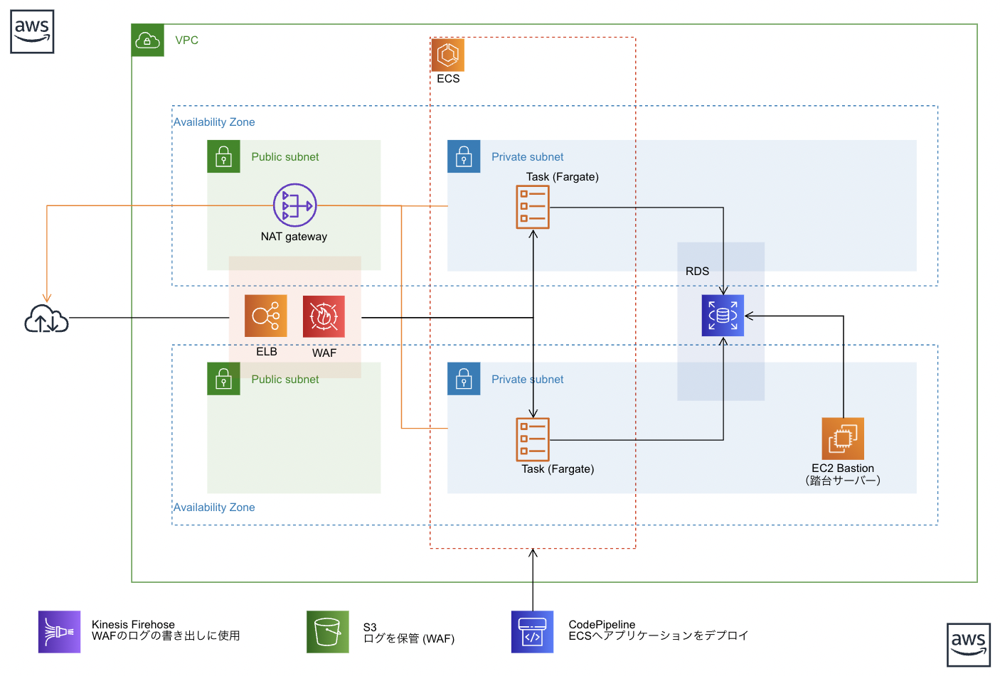
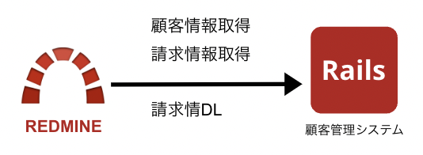
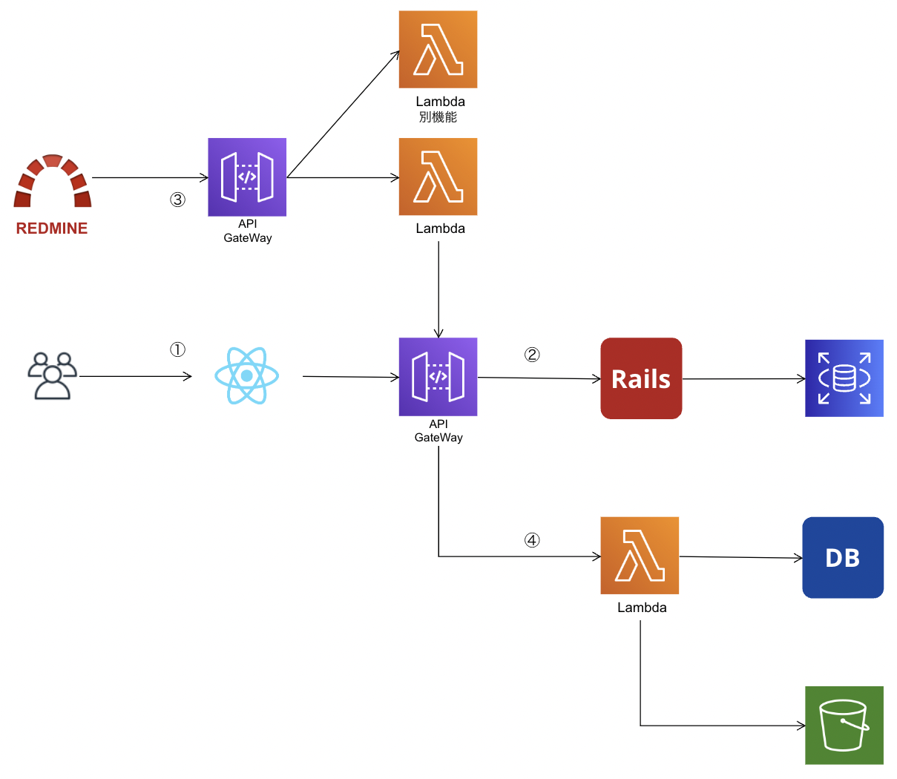
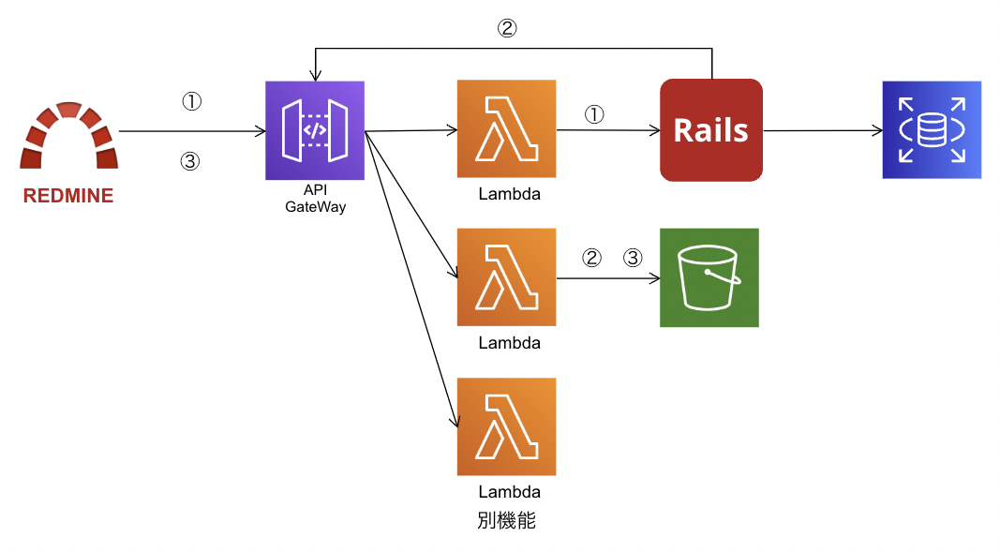
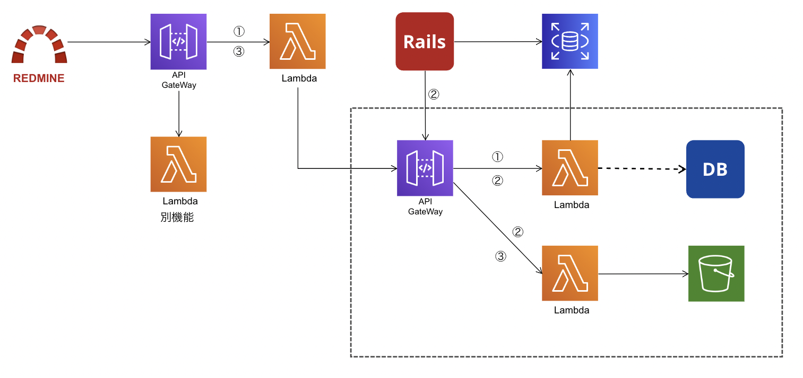
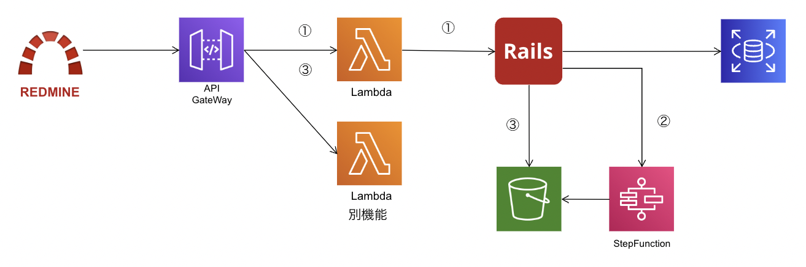

# Ask an Expert in Shimane

## アジェンダ

1. サービスの説明
2. 構成図
3. 課題
4. 解決策

## 1 サービスの説明

Redmine: OSSのプロジェクト管理ツール  
顧客管理システム: 顧客情報管理、契約情報管理、請求情報管理、etc

## 2 構成図

基本的には ALB + ECS + RDS

Twelve-Factor App 大事 
https://12factor.net/ja/

### 質問

Q1. Aurora Serverless V2 について 
たまにしかアクセスのないサービスであれば有効だと思いますが、  
Railsのようなサービス（常時DBにアクセスが発生する）においては恩恵を最大限に受けれないとい理解で良いか？

## 3 課題

### 課題1. 負荷の高い処理によってサーバー全体のアクセスに影響が出るケースが発生

**顧客管理システムの一部機能の負荷が高い問題が発生。**

例1：顧客管理システムの請求書作成。  
数百件を超える請求書（PDF）作成をRailsで実行すると負荷が上昇しアクセスしづらい状況が発生。

例2：Redmineの検索とCSV生成 
1.カスタムフィールドが大量にあるチケットの表示または検索（複数のテーブルを跨いだ検索） 
2.エクスポート用のCSVファイルの作成で負荷が上昇する。（しかもバックグラウンド処理になっていない）

### 課題2. アプリケーション間のセキュアな通信。

**Redmineと顧客管理システムの連携**

例1：Redmineで顧客の登録情報を表示したい 
アプリケーション間の通信が必要になってきた。（Redmineから顧客管理システムにアクセスする）  
Redmineを利用しているユーザーが契約情報や請求書を取得したいが、顧客管理システムから情報を取得しないといけない。  
顧客管理システムのAPIにどのようにアクセスするか。また、請求書情報の取得とダウンロードできるようにしたい。

## 4 解決策

### 理想（こうありたい姿）

1. MVC の Model, Controller と View を分離し、RailsをAPIサーバーにする。
2. RedmineとAPI（rails）を連携するAPIを準備
3. RedmineがアクセスできるAPIを作成
4. controller 単位で機能を外部のAPIに移行していく（DBも分割していく）

### 質問

Q2. Lambdaで 7MB を超えるレスポンスを受け取りたい場合はどのような受け取り方法があるか？？  

今のところS3から署名付きURLを発行して、そちらにリダイレクトして回避しているが、できれば Lambda から直接レスポンスが欲しい。  
もしかするとlambdaのストリーミング機能で対応できる？

Q3. Lambdaがすごく大きくなる可能性がある。  

レイヤーを利用する場合、同じプロダクト内でlayerを共有する場合は問題が起きにくいが、複数のプロダクトで共有する場合はちょっと怖い。  

Railsだとバックエンド（model or controller）で加工（viewで表示しやすい状態）して、view（フロントエンド）にデータを渡すことが多いが、未加工のデータをフロントエンドで加工すると良い？  
隠蔽したいデータもあるので、Apigatewayから直接Dynamodbを叩かず、lambdaを間にはさんでバリデーションやフォーマットをしたい。

### 現実

1.Viewの分離が難しい（かなりの工数がかかる）   
2.DBの分離が難しい（技術的、工数的） 

↓

課題となっている部分だけ、Railsから切り離してAPIを作っていくという考え方に落ち着く

### やったこと（現在進行形）

課題1に対して  

1. 顧客管理システムはスケールアップで対応 
1. Redmineはpluginを検討。（事実上の放置）

課題2に対して  

1. 顧客管理システム側で連携用のAPIを準備し、契約者の情報を取得、請求情報の取得ができるようにした。
1. 請求書データ（PDF）をS3にアップロードする機能をAPIに追加した。（顧客管理システムからアクセス）
1. 請求書データ（PDF）をS3からダウンロードする機能をAPIに追加した。（Redmineからアクセス）

### 今後やりたいこと

課題１の請求書生成の処理をRailsから切り離して負荷を下げたい。  
また、それに合わせて、Redmineからアクセスも考慮にいれつつ請求書関連の機能としてAPI化を進めたい。  
Railsをどのように分割していくべきか考える。

  
候補１  
将来的に機能の分割を意識して、DBをラップするAPIを作り、請求関連の情報は全てそちらからアクセスさせる。
API経由でデーターにアクセスする（登録、更新、削除）

1. 契約情報の取得、請求情報の取得
1. 請求情報の作成・更新、請求書の生成
1. 請求書のダウンロード

  
候補２  
データーの管理は顧客管理システムに集める。分割しない。  
api-gatewayは参照するだけ（プロキシー）

1. 契約情報の取得、請求情報の取得
1. 請求情報の請求書の生成（railsからStepfunctionsをコール）
1. 請求書のダウンロード

#### 進める上で心がけていること
- 悩むよりも実装を進めてみる  
- 拡張性（後で変更しやすい）
  - 可逆、不可逆の変更を考慮しながら作業を進める。（DBの分離は後戻りできない）  
- 無停止で変更できる
- セキュリティの考慮
  - 細かな設定ができることと、管理の手間はトレードオフ

### 質問

Q4. 候補１, 候補２どちらの方が筋が良さそうか。

候補１ 将来的にDBの分割も視野に入れて分割を進める。  
候補２ rails で負荷のかかる機能だけは外部に切り出し、基本的には Rails で API を準備しそちらにアクセスさせる。

Q5. 今後、他の機能の分割を検討したときにはDBの分割はすべきか  
マイクロサービスでも必ず分割が必要ではないという認識ですが、今回のケースだと分割するケース、しないケースだとどのようなメリットデメリットが考えられるでしょうか？
今のところ、分割しなかった場合、
顧客管理システムでデータに変更を加える処理が書けてしまう。
Lambda側の実装が大変。（ActiveRecordeと同じような処理が必要）

Q6. APIに破壊的な変更がある場合、APIとアプリケーションを同時に変更する必要がある場合はどのような回避方法があるか？  
APIの認証方式をIPによる制限からIAMによる制限に変えた場合の対応  
APIのデプロイ（IAMによる認証に変更）とアプリケーション側ではv4署名をヘッダーに追加という作業が必要だった。

Q7. redmineの検索については pluginを作成して検索の高速化を考える。そのときの実装方法についてどれが良さそうか。  
- 検索用のtableを準備する
- redisにキャッシュする（永続化の仕組みは必要）
- opensearchを使用する。

Q8. WEBフレームワークを利用して、ルーティングをおこなる方法とAPIGateWayを利用してルーティングするパターンとどちらが良いでしょうか？  
例えば、Node js の express や、Python の Django を使用してlambda内でルーティングする方法。  

フレームワークを利用した場合  
- コールドスタートが減らせるかも？  
- エンドポイントごとのアクセス制御が面倒？

### 余談

**モジュラーモノリス**

モジュラーモノリスも検討したが、負荷に対する解決策にはならない。  

技術的なハードルも高そう。（依存関係の制御が難しそう）  
→ メソッドのオーバーライド（モンキーパッチ）ができるので、何かしら制御が必要。

**モノリスとマイクロサービス**

最近、「モノリス vs マイクロサービス」みたいな話題が一部で取り上げられてました。私見をお聞きしたい。  
https://www.publickey1.jp/blog/23/amazondhhamazonvogels.html

